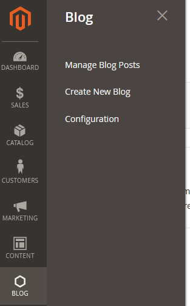

# SebTech - Blog

This Magento 2 plugin adds blogging functionality to your Store. 

## Requirements

- Magento 2.4 (Tested 2.4.3^)
- PHP 7.4

## Features

- Creating, Deleting, Updating of blogs.
- Supports the Magento Pag Builder.

## installation

- No composer support at the moment.
    - Git clone this project inside you app/code folder under SebTech/Blog

# How to use

## See the backend admin:  

  

## Under configuration:

- Render Blogs 
    > Set this value to Yes to render all the available blogs the frontend and make the route available.
- Add Link In Footer
    > Set this value to yes if you want to put a link to the blogs inside your website footer.

